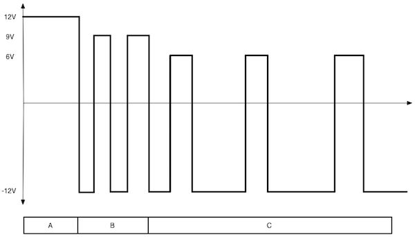
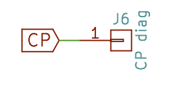
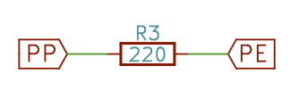
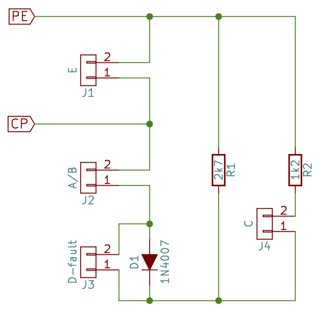
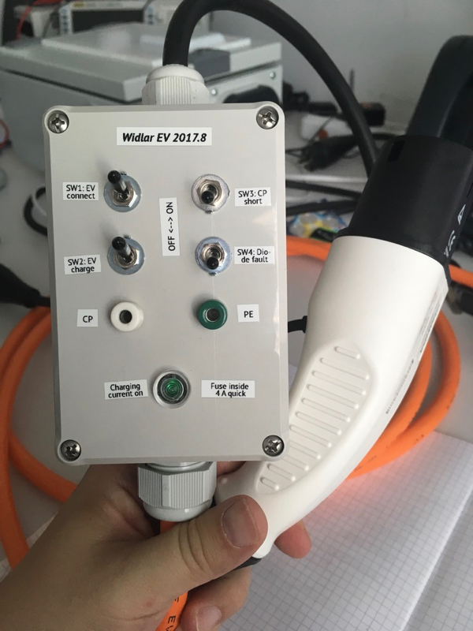
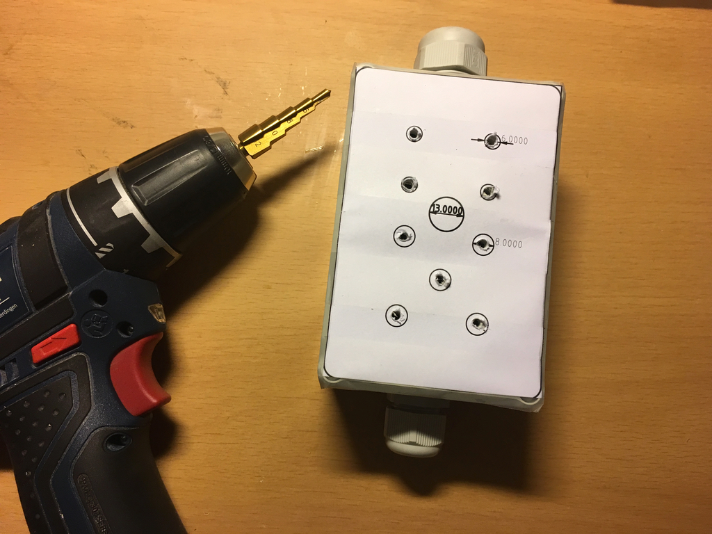
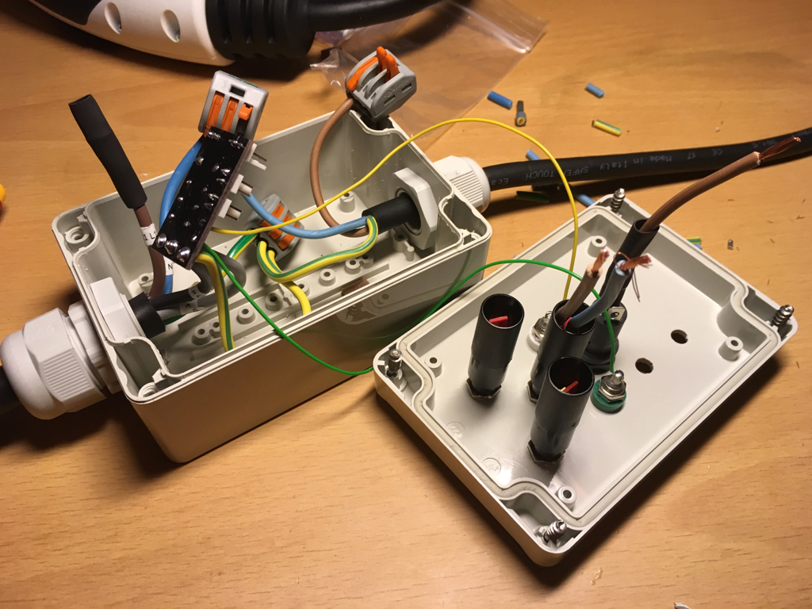
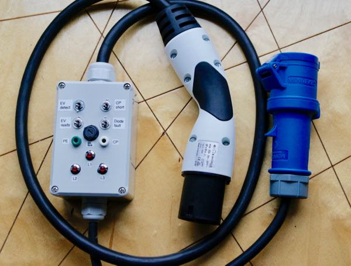
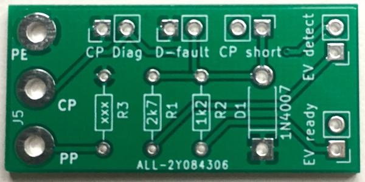
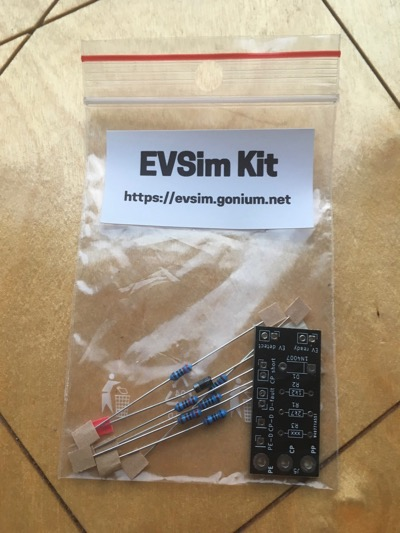

# Worum geht es hier?

Eine Ladestation für Elektroautos ist eine glorifizierte
Drehstromsteckdose. Damit die Ladestation den Strom anschaltet muss man
ihr ein Auto vorgaukeln --- dazu nutzt man einen Autosimulator.
Mit dem hier vorgestellten Simulator kann man z.B.

* Einen [Funktionstester für Wallboxen bauen](#ladestationstester) und
damit [Ladestationen prüfen](#pruefung),
* einen [Ladesäule-nach-Wohnwagen-Adapter bauen](#wohnwagenadapter) oder
* einen eigenen Laderegler an Typ2-Ladesäulen anschließen.

Natürlich kann man aber auch ein Waffeleisen damit betreiben:

<iframe width="640" height="360" src="https://www.youtube.com/embed/pUEp3uWAWqY?rel=0" frameborder="0" allowfullscreen></iframe>

Bevor eine Ladesäule den Ladestrom freischaltet, wird zunächst eine
einfache Kommunikation mit dem Elektroauto aufgebaut. Dabei wird z.B.
geprüft, ob wirklich ein Elektroauto angeschlossen ist. Außerdem
wird dem Elektroauto auch der maximal verfügbare Ladestrom von der
Ladesäule mitgeteilt. 

Der Simulator setzt das Ladeprotokoll nach DIN EN 61851-1:2012 bzw.
J1772 um. Die passende Platine kann für eigene Experimente gekauft werden,
siehe [Bezugsquelle](#bezugsquelle).  Die Platine entstand, weil ich
eine Softwareschnittstelle zu einer Wallbox entwickeln wollte. Da der
Ladevorgang das mindestens das Durchlaufen der Zustände A-C vorsieht hab
ich einen kleinen Simulator gebraucht, der auf dem Schreibtisch liegen
kann und ein Auto simuliert. Mit diesem Simulator kann man alle
Ladezustände eines Elektroautos simulieren und die Reaktion der Wallbox
prüfen. Über Schalter lassen sich verschiedene Zustände einstellen sowie
Fehler wie eine defekte Diode und einen Kurzschluss zwischen CP und PE
simulieren. Ebenso kann man einen Ladevorgang simulieren und dann die
notwenigen Sicherheitsprüfungen an der Wallbox durchführen.

# Wie kommuniziert das Elektroauto mit der Ladesäule?

Eine Typ 2-Steckdose beinhaltet nicht nur die Stromversorgung, sondern
auch zwei Kommunikationsleitungen. Über diese werden folgende Funktionen
koordiniert (vgl. DIN EN 61851-1:2012):

* Überprüfung, ob das Fahrzeug vorschriftsmäßig angeschlossen ist,
* ständige Überwachung des Schutzleiterdurchgangs,
* Einschalten des Systems,
* Ausschalten des Systems,
* Auswahl des Ladestroms,
* Einstellen des Ladestroms,
* Sperren/Freigeben der Stecker.

Ein Typ2-Stecker benutzt dafür folgenden Leitungen:

* Einem Drehstromanschluss, also die drei Außenleiter L1, L2 und L3,
	einem Neutralleiter N sowie einer Schutzerde PE.
* Einer Signalleitung "Proximity Plug" (PP), über welche
	die Strombelastbarkeit des Kabels erkannt wird.
* Einer Signalleitung "Control Pilot" (CP). Auf dieser Leitung werden
	Sicherheitsprüfungen durchgeführt sowie der maximale Ladestrom dem
	Elektroauto mitgeteilt. Das Elektroauto signalisiert außerdem, ob es
	für eine Ladung bereit ist.

Die Kommunikation ist sehr simpel --- auf der Seite der Ladestation
reichen ein paar analoge Bauteile aus, siehe z.B.
[AnalogEVSE](http://analogevse.xyz). Auf der Seite des Fahrzeugs sind
ebenfalls nur sehr wenige Komponenten erforderlich.

## Der Proximity Plug (PP)

Der maximal zulässige Ladestrom, den das Kabel verkraftet, wird über
einen Widerstand zwischen PP und der Schutzerde PE kodiert. Nach DIN EN
61851-1:2012 sind folgende Widerstände zulässig:

| Widerstand | Maximaler Ladestrom |
|-----------:|--------------------:|
| 100 Ohm    |               63 A  |
| 220 Ohm    |               32 A  |
| 680 Ohm    |               20 A  |
| 1500 Ohm   |               13 A  |

Werte kleiner als 75 Ohm oder größer als 2200 Ohm werden als Fehler
interpretiert. Dieser Widerstand beschreibt den *maximalen* Ladestrom:
Wenn dieser überschritten wird kommt es zu Schäden am Kabel. Der
reale Ladestrom muss also kleiner bleiben. Der Widerstand muss eine
Belastbarkeit von mehr als 0,5 Watt haben.

Üblicherweise wird ein entsprechender Widerstand in den Typ2-Stecker
selbst integriert. Das Gehäuse des Steckers bietet viel Platz für einen
Widerstand --- mit etwas Schrumpfschlauch entsteht so ein robuster und
sicherer Aufbau. Die EVSim-Platine bietet aber ebenso einen Platz für
den Widerstand.

## Der Control Pilot (CP)

Der Control Pilot setzt die restlichen Funktionen um. Dabei
schaltet das Elektroauto zwei verschiedene Widerstände zwischen CP und
PE. Zusätzlich wird eine Diode in CP gesetzt.  Die Wallbox erzeugt ein
Kleinspannungssignal, welches dann durch die Widerstände und die Diode
verändert wird. Dadurch können verschiedene Zustände detektiert und der
momentan verfügbare Ladestrom kommuniziert werden.

Die folgenden sechs Zustände sind möglich:

| Zustand| Fzg. angeschlossen | Laden möglich | Spannung CP-PE  | Frequenz |
|:-------|:-------------------|:--------------|----------------:|:---------|
| A      | Nein               | Nein          | 12V             |DC        |
| B      | Ja                 | Nein          | 9V/-12V         |1 kHz     |
| C      | Ja                 | Ja            | 6V/-12V         |1 kHz     |
| D      | Ja                 | Ja            | 3V/-12V         |1 kHz     |
| E      | Ja                 | Nein          | 0V              | -        |
| F      | Ja                 | Nein          | -               | -        |

Im Zustand A ist kein Fahrzeug angeschlossen. Die Wallbox legt eine
Gleichspannung von 12V zwischen CP und PE an. Sobald ein Kabel
eingesteckt wird, wechselt die Wallbox in den Status B: Die
Gleichspannung wird durch ein PWM-Signal mit 1kHz ersetzt, zwischen -12V
und 12V. Die Diode im Fahrzeug bewirkt, das der negative Anteil
verworfen wird. Auf diese Weise kann die Wallbox ein Fahrzeug von einem
zufälligen Kurzschluss (z.B. Kabel liegt im Regen) unterscheiden. Im
Fahrzeug wird außerdem ein Widerstand von 2k7 Ohm zwischen CP und PE
geschaltet. Damit sinkt die positive Spannung auf 9V ab. Das Fahrzeug
ist nun korrekt angeschlossen und der Zustand B erreicht.

Sobald das Fahrzeug zum Laden bereit ist wird ein weiterer Widerstand
(1k2 Ohm) zwischen CP und PE geschaltet. Damit sinkt die CP-PE-Spannung
auf 6V, der Zustand C ist erreicht. Die Wallbox schaltet den Ladestrom
frei, der Ladevorgang beginnt. Für das Laden von Bleibatterien kann eine
Lüftungsanforderung gesendet werden (Zustand D). Damit signalisiert ein
Fahrzeug, das für einen Ladevorgang eine Belüftung notwendig ist --- die
Wallbox kann diese entweder sicherstellen oder den Ladevorgang
abbrechen. *Achtung: Dieser Anwendungsfall ist mittlererweile recht
selten. Daher ist dieser Widerstand auf der Platine nicht vorgesehen.*

Die Zustände E und F sind Fehlerzustände, in denen die Stromversorgung
zum Elektroauto unterbrochen wird. E zeigt einen Kurzschluss zwischen CP
und PE an. Der Zustand F kennzeichnet einen Ausfall der Wallbox:
Zwischen CP und PE besteht keine Verbindung.

Die Ladesäule teilt dem Auto den zur Verfügung stehenden Ladestrom mit.
Dafür wird der Duty Cycle des PWM-Signals angepasst. Dabei gibt es eine
Besonderheit: Die ISO 15118 legt einen Duty Cycle von 5% fest, wenn der
Ladevorgang digital ausgehandelt werden soll (z.B. bei CCS). Es gilt:

| Ladestrom | Duty Cycle (+/- 1%) |
|:----------|:--------------------|
| Digitales Protokoll | 5% |
| 6A - 51A  | $$ dc = \frac{Strom [A]}{0.6} $$ entspricht 10%--85% |
| 51A - 80A  | $$dc = \frac{Strom [A]}{2.5} + 64$$ entspricht 85%--96%|

Ein Duty Cycle kleiner 5% oder größer 96% ist nicht zulässig. Grafisch
sieht das so aus:

# Funktionsweise der Platine

**Achtung: In die Versionen kleiner 0.5 hat sich ein Fehler
eingeschlichen --- diese Schaltungen funktionieren zwar, folgen aber dem
Signalablauf des "Simplified Mode". An einigen Ladereglern führt dies
dazu, das der Ladestrom auf 10A begrenzt wird. Im Folgenden beschreibe
ich die Version 0.5.**

Der komplette [Schaltplan (v0.5) ist hier (PDF)](img/Schaltplan-v0.5.pdf). Die
einzelnen Komponenten stelle ich im Folgenden vor. Zunächst einmal
bietet die Platine eine Anschlußmöglichkeit für PP, CP und PE:

Daran können die entsprechenden Signalleitungen des Ladekabels an die
Platine angeschlossen werden. Diese bietet für CP und PE wiederum einen
separaten Anschluss an:

Dort kann man z.B. Messbuchsen verbinden, um den Control Pilot
beobachten zu können. So kann man den Duty Cycle ausrechnen und z.B.
nachprüfen, ob der Ladestrom von der Ladestation korrekt signalisiert
wird. Diese Anschlussmöglichkeit kann aber auch ungenutzt bleiben.

Um den Strom des Ladekabels festzulegen wird ein Widerstand zwischen PP
und PE benötigt. Dieser wird auf der Platine R3 genannt und wird mit 220
Ohm (min. 0,5 Watt, für 32 A Strombelastbarkeit) bzw. einem anderen
Widerstandswert bestückt:

Normalerweise wird dieser Widerstand direkt im Typ2-Stecker montiert.
Allerdings bietet die Platine auch die Möglichkeit, den Widerstand
direkt auf die Platine zu löten --- je nach Anwendungsfall ist das eine
oder das andere praktischer.

Damit ein Ladestrom freigegeben wird, muss das Elektroauto das CP-Signal
entsprechend ändern. Die Platine bietet dazu folgende Möglichkeiten:

Über den Kontakt "E" kann man PE und CP kurzschließen. Eine Ladestation
muss in diesem Fall die Ladung umgehend beenden bzw. den Ladestrom erst
gar nicht freigeben. Ähnlich ist es mit dem Kontakt "D-fault": Die Diode
D1 (1N4007) sorgt dafür, das der negative Anteil des Pilotsignals
weggeschnitten wird. Anhand dieses Signals erkennt die Wallbox, das
tatsächlich ein Elektroauto angeschlossen ist --- und der Stecker nicht
einfach nur im Regen hängt. Wenn man "D-fault" also schließt, wird die
Diode überbrückt und der negative Anteil des PWM-Signals verändert sich
analog zum positiven Anteil. Auch hier darf die Ladestation den
Ladevorgang nicht freigeben.

Die restlichen Kontakte schalten Widerstände etc. zwischen CP und PE
hinzu. Normalerweise trennt der Schalter in der Position "A" alles von
CP und PE, es gibt keine Verbindung. Wechselt man nach "B", so wird die
Diode zusammen mit R1 (2k7 Ohm, min. 0,5 Watt) eingeschleift. Das
signalisiert der Wallbox, das ein Elektroauto angeschlossen ist --- und
das der Zustand B erreicht ist.  Schließt man "C", so wird der
Widerstand R2 (1k2, min. 0,5W) hinzugefügt und die Ladestation kann den
Ladestrom aktivieren.

# Aufbauanleitung

**ACHTUNG: Netzspannung kann tödlich sein. Der Fahrzeugsimulator darf
nur von Elektrofachkräften aufgebaut werden. Die im nachfolgenden
dargestellten Aufbauvarianten sind nur als Denkanstoß zu verstehen und
dienen nicht als Bauanleitung für betriebsfertige Geräte.  Insbesondere
hafte ich nicht für alle Schäden, die durch den Einsatz dieser Schaltung
entstehen!**

Die Platine kann für unterschiedliche Anwendungszwecke eingesetzt
werden. Ich zeige hier den Aufbau eines Funktionstesters für
Ladestationen, da alle Funktionen der Platine genutzt werden.  Für alle
Aufbauten gilt: Die elektrische Sicherheit ist durch die Verwendung
dieser Platine nicht zwangsläufig sichergestellt. Wer nicht über die
notwendigen elektrotechnischen Kenntnisse verfügt sollte einen
Elektrofachbetrieb konsultieren! Unter anderem die folgenden Aspekte
müssen bedacht werden:

1. Zugentlastung für alle Kabel muss gegeben sein
2. Die Außenleiter, Neutralleiter sowie die Schutzerde werden
	 durchverbunden (z.B. über Wago-Klemmen)
3. Ein korrekt dimmensionierter Leitungsschutzschalter muss verbaut
	 werden.
4. Alle Komponenten müssen isoliert sein.
5. Alle Komponenten müssen richtig dimensioniert sein
	 (Strombelastbarkeit etc.)

Für alle Aufbauten gilt: Die Widerstände und die Diode müssen eingelötet
werden. R1 (2k7 Ohm) und R2 (1k2 Ohm) sind bei jedem Aufbau gleich. Der
Wert für R3 richtet sich nach der Strombelastbarkeit des
Komplettsystems.  Will man z.B. maximal 13A entnehmen, so lötet man
einen 1k5 Ohm Widerstand an die Anschlüsse für R3.  Bei der Diode muss
darauf geachtet werden, das sie richtig herum eingelötet wird --- der
Strich auf dem Diodengehäuse muss in die gleiche Richtung zeigen wie auf
der Platine markiert. Das folgende Bild zeigt die Version 0.2 der
Schaltung:

Das Layout der Platine hat sich mit Version 0.5 geringfügig geändert ---
die Diode ist nun an einem anderen Platz. Beim Aufbau also bitte immer
auf den Bestückungsdruck achten! Mit diesem Grundaufbau kann es nun je
nach Anwendung weitergehen.

## Aufbau als Ladestationstester {#ladestationstester}

Als Gehäuse hat sich das Bopla ET 215 bewährt. Für dieses Gehäuse kann
man [hier auch eine Bohrschablone herunterladen
(PDF)](img/Bopla-ET215-DrillTemplate.pdf). Am Besten mit einem kleinen
Bohrer (3mm) vorbohren und mit einem Stufenbohrer das Loch auf den
passenden Durchmesser bringen:

Die Kabelverschraubungen bilden die Zugentlastung für die Kabel. Im
Inneren kann man dann z.B. mit Wagoklemmen die einzelnen Leiter
verbinden:

An die Anschlüsse CP-D wird eine Messbuchse für CP, an PE-D die Messbuchse
für PE angeschlossen. Vom Ladekabel werden nun PP, CP und PE an die
Platine gelötet. Hierfür muss man gegebenenfalls eine dünnere Litze über
eine Wagoklemme o.ä. mit dem dickerem Schutzleiter verbinden. Die
Glimmlampe installiert man zwischen den Außenleitern und dem
Neutralleiter.

Wenn man eine Drehstrom- oder Schukokupplung installiert kann man
darüber auch einen RCD-Test durchführen und das Drehfeld kontrollieren.
Außerdem kann man natürlich auch ein Gerät an den Simulator anschließen.
Da aus einer Typ2-Steckdose mehr Strom entnommen werden kann, als eine
Schukokupplung maximal zur Verfügung stellen darf, muss in diesem Fall
unbedingt eine Sicherung vorgesehen werden. Dazu eignet sich z.B. ein
Leitungsschutzschalter (A-Charakteristik) oder eine flinke
Schmelzsicherung. Der Auslösestrom muß der Dauerbelastbarkeit der
schwächsten Komponente entsprechen: Bei einer Schukokupplung sind das
13A, bei einer einphasigen CEE-Kupplung 16A.

Es fehlen nur noch die Kippschalter --- über diese kann man verschiedene
Fehler und Fahrzeugzustände simulieren. So kann auch ein
kurzgeschlossener CP oder ein Diodenfehler simuliert werden.  Außerdem
zeigt eine oder mehrere Glimmlampe an, ob ein Ladestrom an der
entsprechenden Phase anliegt.  Um die Fehlersuche zu erleichtern kann
man auch Messbuchsen für den Anschluss eines Multimeters oder
Oszilloskops vorsehen.

Für einen sauberen Aufbau nutze ich die [Kippschalter MS500A (Reichelt-Link)](https://www.reichelt.de/Kippschalter/MS-500A/3/index.html?ACTION=3&GROUPID=7584&ARTICLE=13150&OFFSET=16&) mit angelöteten, [zweipoligen Platinensteckverbindern (Reichelt-Link)](https://www.reichelt.de/Platinen-Steckverbinder/PS-25-2G-WS/3/index.html?ACTION=3&GROUPID=7525&ARTICLE=14825&OFFSET=16&):

Bei diesen Kippschaltern muss man jedoch darauf achten, das im Innern
des Autosimulators keinesfalls ein Kontakt zur Netzspannung entstehen
kann. Sicherer ist es, einen Kippschalter der Schutzklasse II zu
verwenden, d.h. es kann keine Netzspannung zum Anwender gelangen.

Die Kippschalter werden wie folgt verdrahtet:

| Text     | Anschluss| Funktion Kippschalter      | Ladestrom |
|:---------|:---------|:---------------------------|:----------|
| D-fault  | J1       | Test Diodenfehler          | aus       |
| A/B, EV detect| J2       | Fahrzeug angeschlossen (R1)| aus       |
| E, CP short | J3       | Test CP Kurzschluss        | aus       |
| C, EV ready | J4       | Fahrzeug ladebereit (R2)   | ein (falls J2 ein) |

## Prüfung einer Ladestation {#pruefung}

Ladestationen sind Bestandteil der Niederspannungsinstallation und müssen
gemäß der VDE 0100-600 geprüft werden. Die Prüfung kann in drei Bereiche
unterteilt werden: Sichtprüfung, Messung und Funktionsprüfung.
Innerhalb einer Ladestation sind auch Sicherheitsfunktionen
umgesetzt: Ein Teil der Messungen kann also nur während eines
Ladevorgangs durchgeführt werden. Daher benötigt man zur Prüfung einen
Fahrzeugsimulator.

Jede Prüfung beginnt mit einer Sichtprüfung: Ist das Gehäuse beschädigt?
Könnte Wasser in die Ladestation gelangt sein? Ist die Isolierung der
Kabel brüchig/beschädigt? Sind andere Gefahren erkennbar? Im Anschluss
kann mit den Messungen begonnen werden:

* Spannung (L-N, L-PE)
* Durchgängigkeit des Schutzleiters $R_{lo}$
* Isolationswiderstand $R_{iso}$
* Netzimpedanz $Z_i$
* Schleifenimpendanz $Z_s$
* Erdwiderstand
* Ausschaltzeit des FI $t_a$
* Auslösestromart des FI (Wechsel,- Puls-, Gleichfehlerstrom)
* Auslösestrom des FI (Flankenanstieg)
* Drehfeldprüfung (Richtung des Drehfelds egal)
* Duty Cycle (Tastverhältnis) des Control Pilot

Einige dieser Messungen müssen am Fahrzeugstecker unter Spannung
durchgeführt werden. Indem man den Fahrzeugsimulator in den Zustand C
bringt kann man diese mit dem normalen Installationstester durchführen.
Man misst also während des Funktionstests. Der Funktionstest selbst
beginnt mit dem Simulieren eines normalen Ladeablaufs (vgl. Abschnitt
["Der Control Pilot (CP)"](#der-control-pilot-cp) bezüglich der
			Zustände):

1. Den Tester mit der Ladestation verbinden. Alle Schalter sollten auf
	 der "Aus"-Position sein. Der Zustand A ist erreicht.
2. Den Schalter "EV detect" bzw. "A/B" einschalten. Daraufhin sollte die
	 Ladestation den Stecker verriegeln. Dies entspricht Zustand B.
3. Den Schalter "EV ready" bzw. "C" umlegen. Die Ladestation sollte nun den
	 Ladeschütz freigeben und die Glimmlampen sollten einen anliegenden
	 Ladestrom signalisieren --- der Zustand C ist erreicht.
4. Der Ladevorgang kann jederzeit unterbrochen werden, indem man "EV
	 ready"/"C" ausschaltet. Durch erneutes Einschalten sollte der Ladestrom
	 wieder angeschaltet werden.
5. Um den Stecker wieder entfernen zu können schaltet man "EV ready" bzw. "C" und
	 "EV detect" bzw. "A/B" aus. Der Stecker sollte entriegelt werden.

Dieser grundlegende Ablauf sollte bei jeder Ladestation problemlos
funktionieren. Zusätzlich sollte man die folgenden Messungen
durchführen:

1. Im Zustand C: Der FI wird wie oben dargestellt geprüft.
2. Im Zustand C: Das Drehfeld der Außenleiter ist korrekt, wobei die
	 Drehfeldrichtung keine Rolle spielt.
3. In den Zuständen A, B, C und D: Wenn man "CP short" bzw. "E"
	 einschaltet muss die Ladestation einen Fehler anzeigen und in den
	 Zustand E wechseln. Es darf kein Ladestrom anliegen!
4. In den Zuständen A, B, C und D: Sobald "Diode fault" eingeschaltet
	 wird muss die Ladestation einen Fehler anzeigen und in den Zustand E
	 wechseln. Es darf kein Ladestrom anliegen!

Der letzte Test ist umstritten: Die DIN 61851-1:2012 bietet hier einen
gewissen Interpretationsspielraum, ob der Diodenfehler nur zu Beginn des
Ladevorgangs (Zustand A) oder auch in den anderen Zuständen permanent
detektiert werden muss. Die Hager-Ladestationen überwachen permanent.
Die Ladecontroller von Phoenix Contact und die
Keba-Ladestationen führen den Test lediglich im Zustand A, also zu
Beginn des Ladevorgangs, durch. [Im
goingelectric-Forum gibt es dazu mehr
Informationen](https://www.goingelectric.de/forum/ladeequipment/diodentest-machen-wallboxen-das-korrekt-t27212.html).

**Achtung:** Ich habe bereits TÜV-geprüfte Wallboxen eines chinesischen
Herstellers untersucht, die weder auf "CP short" noch "Diode fault"
prüfen. Sobald ein passender Widerstand zwischen CP und PE liegt wird
der Drehstrom angeschaltet. In meinen Augen ist das hochgefährlich. Man
sollte also die korrekte Funktion unbedingt prüfen und sich nicht auf
ein TÜV-Siegel verlassen!

Weiterhin sollte man prüfen, ob Ladekabel mit zu kleiner maximaler
Strombelastbarkeit von der Ladestation abgelehnt werden. Beispielsweise
sollte ein Ladekabel mit 13A maximaler Belastbarkeit von einer mit 20A
abgesicherten Ladestation abgelehnt werden. Ansonsten könnte bei einem
Fehler das Kabel überlastet werden, ohne das der Leitungsschutzschalter
der Ladestation auslöst.

Als letztes muss auch der Dutycycle des Control Pilots überprüft werden,
da dieser den maximalen Ladestrom der Ladesäule dem Auto mitteilt. 
Mit einem Oszilloskop oder Multimeter zwischen CP und PE misst man dafür
den Duty Cycle und kann diesen dann in den Ladestrom umrechnen. Das
folgende Bild zeigt eine Ladestation von Hager im Zustand C:

Man kann ein Rechtecksignal mit einer Grundfrequenz von 1kHz erkennen.
Das positive Spannungsniveau liegt bei 6V, das negative bei -12V. Der
Duty Cycle liegt bei 16.4%. Es gilt:

$$ Strom [A] = 0.6\cdot dc = 0.6 \cdot 16.4 = 9.83 $$

Das entspricht in etwa der hier eingestellten Ladestrombegrenzung von
10A, d.h. die Ladestation arbeitet korrekt.

### Z.E. Ready

Für Z.E. Ready-Ladestationen gelten zusätzlich noch die Bestimmungen von
Renault. Einerseits muss die Ladestation konstruktiv diese Vorgaben
erfüllen (z.B. DC-Fehlerstromerkennung und die Dimensionierung der
Leitungsschutzschalter), andererseits muss auch die Installation
gewisse Anforderungen erfüllen. Dazu gehören:

1. TT/TN-Netze: Erdungswiderstand kleiner 100 Ohm
2. TT/TN-Netze: Spannung N-PE nicht größer 10V
3. Spannungsdifferenz der Außenleiter gegen Neutralleiter < 10V
4. Oberwellen können den Ladevorgang beenden. Die Netzversorgung muss IEC 61000-2-1, IEC 61000-2-2 sowie EN 50160 erfüllen.

Die Relevanz dieser Kriterien ist allerdings umstritten, siehe [diesen
Thread im
Goingelectric-Forum.](https://www.goingelectric.de/forum/ladeequipment/z-e-ready-was-bedeutet-das-genau-t27327.html).
Im Wiki von Goingelectric werden außerdem [die technischen
Mindestvoraussetzungen](https://www.goingelectric.de/wiki/Renault_ZOE:_Technische_Mindestvoraussetzungen_f%C3%BCr_zuverl%C3%A4ssige_Ladung_Modell_210)
für das Laden einer ZOE 210 diskutiert.

## Aufbau als Wohnwagenadapter {#wohnwagenadapter}

Mit diesem Adapter kann man einen Wohnwagen oder Caravan an eine
Ladestation anschließen, um z.B. während einer Reisepause Strom im
Fahrzeug zu haben. Der grundlegende Aufbau entspricht dem
Ladesäulentester oben, wobei auf die Testschalter für den CP-Test (J1 und
J3) verzichtet werden kann. Ebenso kann man auf den Schalter J4 (EV
ready) verzichten: Dieser signalisiert die Ladebereitschaft, sobald der
Adapter angeschlossen ist. Den Schalter ersetzt man einfach durch eine
Drahtbrücke. Dies hat allerdings den Nachteil, das die Ladestation ---
je nach verwendetem Laderegler --- den "simplified mode" annimmt und nur
10A Ladestrom freischaltet. Keinesfalls darf man allerdings auf den
Schalter J2 (EV detect) verzichten: Ansonsten kann es passieren, das man
die Verriegelung des Steckers nicht wieder lösen und das Kabel nicht aus
der Ladesäule gezogen werden kann.

Da aus einer Typ2-Steckdose mehr Strom entnommen werden
kann, als eine blaue CEE-Steckdose maximal zur Verfügung stellen darf, muss
unbedingt eine Sicherung vorgesehen werden. Dazu eignet sich z.B. ein
Leitungsschutzschalter (16A, A-Charakteristik) oder eine flinke
Schmelzsicherung (16A). Diese muss in die Außenleiter integriert
werden. Ebenso muss man --- entgegen dem Bild oben --- auf die
Wetterbeständigkeit achten. Man sollte also einen IP65-Schalter und ein
entsprechendes Gehäuse mit geeigneten Kabeldurchführungen verwenden.

# EVSim kaufen

Die Designdaten (und diese Anleitung) sind Open Source und unter
[https://github.com/gonium/EVSE-Car-Simulator](https://github.com/gonium/EVSE-Car-Simulator)
verfügbar. Die Schaltung kann man natürlich recht schnell auf einer
Lochrasterplatine aufbauen. Wer lieber einen kleinen Bausatz haben
möchte, kann diesen bei mir bestellen. Der Bausatz enthält:

* Eine Platine (37x18mm) wie oben beschrieben. Die Version 0.2 war eine
schwarze Platine, die aktuelle Version 0.3 ist grün.
* Ein Set Widerstände R1-R3 mit verschiedenen Werten für R3, um
unterschiedliche Strombelastbarkeiten kodieren zu können.
* Die Schutzdiode (1N4007).

Das Ganze kommt --- zusammen mit einer Rechnung --- so bei Euch an:

Der Bausatz kostet 6 Euro, der Versand innerhalb Deutschlands bei kleinen Mengen
2 Euro --- bei größeren Mengen entsprechend mehr. Zum Bestellen einfach eine
Mail an [evse@gonium.net](mailto:evse@gonium.net?subject=EVSim Bestellung) 
schreiben. In der Mail bitte die gewünschte Anzahl sowie die
Rechnungsadresse angeben. Ich schicke direkt eine Auftragsbestätigung mit den
Zahlungsinformationen. Sobald das Geld bei mir eingegangen ist verschicke
ich zeitnah --- natürlich mit einer Rechnung.

<!-- 

TODO: Die Bauteilliste beinhaltet ungeprüfte Bauteile. Daher vorerst
auskommentiert, bis alle Bauteile tatsächlich geprüft wurden.

## Weitere Bauteile bei Reichelt bestellen

Arne war so nett und hat mir seine Reichelt-Einkaufsliste zur
Verfügung gestellt. Diese enthält Vorschläge für die Teile,
die nicht im Bausatz enthalten sind. Dazu folgende Anmerkungen:

1. Die Gummi-Schlauchleitung ist für einen einphasigen Aufbau gedacht,
	 d.h. zwei Adern werden für CP und PP genutzt. Alternativ kann man
	 natürlich auf eine Schlauchleitung mit zusätzlichen Signalleitern
	 ausweichen.

2. Ich habe teilweise andere Bauteile verwendet, daher kann ich nicht
	 garantieren das alles genauso passt wie oben beschrieben. Die
	 Kippschalter (KIPP 1824.1101) sehen recht groß aus. Ich weiß nicht, ob
	 diese in das Bopla-Gehäuse passen.

Außerdem braucht man natürlich noch einen Typ2-Stecker
(Infrastrukturseite) und etwas Schrumpfschlauch.

| Anzahl | Bauteil                      | Bestellnummer |
|-------:|:-----------------------------|---------------|
| 1 | [Gehäuse Bopla ET 215](https://www.reichelt.de/Kunststoffgehaeuse-BOPLA/BOPLA-ET-215/3/index.html?ACTION=3&GROUPID=7712&ARTICLE=5729&SEARCH=bopla%20et%20215&START=0&OFFSET=100&)|Bopla ET 215|
| 5 | [Platinensteckverbinder gerade, weiß, 2-polig](https://www.reichelt.de/Platinen-Steckverbinder/PS-25-2G-WS/3/index.html?ACTION=3&GROUPID=7525&ARTICLE=14825&OFFSET=16&)|PS 25/2G WS|
| 4 | [Kippschalter 6(4)A-250VAC, 2x, Ein-Ein](https://www.reichelt.de/Kippschalter/KIPP-1824-1101/3/index.html?ACTION=3&LA=2&ARTICLE=154582&GROUPID=7584&artnr=KIPP+1824.1101&SEARCH=%252A)| KIPP 1824.1101 |
| 1 | [Bananenbuchse 4mm, vollisoliert, weiß](https://www.reichelt.de/Bananenstecker-Zwergstecker/BB-4-WS/3/index.html?ACTION=3&LA=446&ARTICLE=4898&GROUPID=7473&artnr=BB+4+WS&SEARCH=bananenbuchse)| BB 4 WS |
| 1 | [Bananenbuchse 4mm, vollisoliert, grün](https://www.reichelt.de/Bananenstecker-Zwergstecker/BB-4-GN/3/index.html?ACTION=3&LA=446&ARTICLE=4895&GROUPID=7473&artnr=BB+4+GN&SEARCH=bananenbuchse)|BB 4 GN|
| 1 | [LED-Signalleuchte, 10mm, grün, 230V](https://www.reichelt.de/LEDs-10mm-mit-Vorwiderstand/LED-1940-230GN/3/index.html?ACTION=3&LA=446&ARTICLE=32406&GROUPID=3029&artnr=LED+1940-230GN&SEARCH=signalleuchte%2B230V) | LED 1940-230GN |
| 3 | [Verbindungsdosenklemmen 3fach](https://www.reichelt.de/Luester-Steckklemmen/WAGO-222-413/3/index.html?ACTION=3&GROUPID=5759&ARTICLE=54547&START=0&OFFSET=16&SID=94Wk85LKwQAUAAALN7kf83bba035ef7219f4cc28ccb8ad1528967&LANGUAGE=EN) | WAGO 222-413 |
| 1 | [Kabelverschraubung M25 grau](https://www.reichelt.de/Kabelverschraubungen-Bopla/MBFK-25/3/index.html?ACTION=3&LA=2&ARTICLE=71547&GROUPID=7738&artnr=MBFK+25&SEARCH=%252A) | MBFK 25 |
| 1 | [Kabelverschraubung M20 grau](https://www.reichelt.de/Kabelverschraubungen-Bopla/MBFK-20/3/index.html?ACTION=3&LA=2&ARTICLE=71546&GROUPID=7738&artnr=MBFK+20&SEARCH=%252A) | MBFK 20 |
| 1 | [Gegenmutter für MBFK 25 grau](https://www.reichelt.de/Kabelverschraubungen-Bopla/MGM-25/3/index.html?ACTION=3&LA=517&ARTICLE=44833&GROUPID=7738&trstct=lsbght_sldr::71547) | MGM 25 |
| 1 | [Gegenmutter für MBFK 20 grau](https://www.reichelt.de/Cable-gland-Bopla/MGM-20/3/index.html?ACTION=3&GROUPID=7738&ARTICLE=44832&START=0&OFFSET=16&SID=92WlNASawQATIAAC2FXDw8584fe181a7efb7adf3106ad947764d5&LANGUAGE=DE) | MGM 20 |
| 1 | [Sicherungshalter für 5x20 mm](https://www.reichelt.de/Fuse-Holders/PL-FPG2-40/3/index.html?ACTION=3&GROUPID=7659&ARTICLE=53021&START=0&OFFSET=16&SID=92WlNASawQATIAAC2FXDw8584fe181a7efb7adf3106ad947764d5&LANGUAGE=DE) | PL FPG2-40 |
| 5 | [Sicherung 5x20mm, 250V, 10A, flink](https://www.reichelt.de/Multimeter-Sicherungen/MMS-P7735/3/index.html?ACTION=3&LA=446&ARTICLE=142826&GROUPID=7662&artnr=MMS+P7735&SEARCH=sicherung%2B5x20%2B10A) | MMS P7735 |
| 1 | [Schutzkontaktkupplung Typ F](https://www.reichelt.de/Netzstecker/PCE-25621-SS/3/index.html?ACTION=3&LA=446&ARTICLE=197636&GROUPID=7486&artnr=PCE+25621-SS&SEARCH=schutzkontaktkupplung) | PCE 25621-SS |
| 1 | [Gummi-Schlauchleitung für Typ2-Anschluß H07RN-F, 5 x 2,5mm](https://www.reichelt.de/Gummi-Schlauchleitung/H07RN-F525-10M/3/index.html?ACTION=3&LA=2&ARTICLE=85898&GROUPID=5372&artnr=H07RN+F525+10M&SEARCH=%252A) | H07RN F525 10M |
| 1 | [Gummi-Schlauchleitung für Schukokupplung H07RN-F, 3 x 1,5mm](https://www.reichelt.de/Gummi-Schlauchleitung/H07RN-F315-10M/3/index.html?ACTION=3&LA=2&ARTICLE=24224&GROUPID=5372&artnr=H07RN+F315+10M&SEARCH=%252A) | H07RN-F F315 10M |
-->

# Häufige Fragen (FAQ)

**Ich habe einen Fehler gefunden.**

Für Hinweise auf Fehler etc. bin ich dankbar. Am liebsten sind mir
Fehlerreports [via Github: Hier kann man ein Issue
aufmachen](https://github.com/gonium/EVSE-Car-Simulator/issues). Eine
Mail ist aber auch vollkommen OK.

**Was ist der Unterschied zwischen v0.5 und den vorherigen Versionen?**

In der Schaltung hatte sich ein kleiner (doofer) Fehler eingeschlichen,
der dafür sorgte, das der Ladeablauf eigentlich im sogenannten
"simplified mode" angefragt wird. Das führt je nach verwendetem
Laderegler dazu, das die Ladestation nur einen Ladestrom von 10A
freigibt. Mit der v0.5 habe ich diesen Fehler behoben. Die Bauteile sind
auf der Platine nun etwas anders angeordnet, aber an den Abmessungen
oder dem Platzbedarf hat sich nichts geändert.

Ausserdem habe ich den Bestückungsdruck verändert. Statt "EV detect"
steht nun "A/B", statt "EV ready" steht "C", und statt "CP short" steht
"E" auf der Platine. Damit ist es einfacher, die Schalter den Zuständen
laut Standard zuzuordnen.

**Kannst Du mir nicht ein fertiges Gerät verkaufen?**

Momentan gilt: Leider nein, aus Haftungsgründen. Jeder ist für seine
Aufbauten selbst verantwortlich.

**Kannst Du mir nicht Schalter, Buchsen usw. verkaufen?**

Ich hab das mal angeboten &mdash; leider ist die Nachfrage aber so gering,
das sich das nicht lohnt. Insofern: Leider nein.

**Warum ist der Bausatz so teuer?**

Wenn Du lediglich den Materialwert zugrunde legst kann ich die Frage gut
nachvollziehen. Nimm einfach das passende Zeug aus Deiner Bastelkiste
und bau die Schaltung nach, das ist OK so. Andererseits habe ich recht
viel Zeit in die Dokumentation und die Entwicklung einer einfachen, gut
lötbaren Platine gesteckt. Die Platine muss gefertigt werden, die
Bauteile müssen bestellt und zusammen mit der Platine verpackt werden.
Auch Rechnung schreiben und die ganze Verwaltung machen erstaunlich viel
Arbeit.

Mit anderen Worten: Ob es Dir das Geld wert ist musst Du selbst entscheiden!

**Warum nur Vorkasse? Kann ich nicht via Paypal etc. bezahlen?**

Im Moment nehme ich nur Zahlungen via SEPA-Überweisung im Voraus an. Das
hat hauptsächlich den Grund, das so meine Arbeit überschaubar bleibt und
keine Transaktionsgebühren anfallen. Leider musste ich schon meinem Geld
hinterherrennen &mdash; und dazu hab ich schlichtweg keine Lust.

# Versionshistorie

| Wann       | Was                                                      |
|:-----------|:---------------------------------------------------------|
| 2019.01.03 | V0.5: Fehler simplified mode behoben, neues Layout       |
| 2018.01.25 | V0.3: Anschluss für Diagnose (CP/PE) im Rastermaß 2,54mm |
| 2017.09.09 | V0.2: Bohrungen für CP/PP/PE vergrößert                  |
| 2017.09.04 | V0.1: Initiales Layout                                   |

<!-- VG Wort Zählpixel -->

